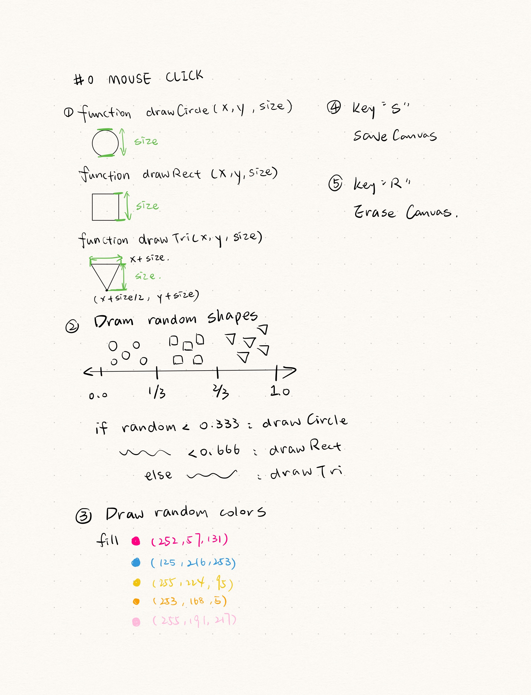
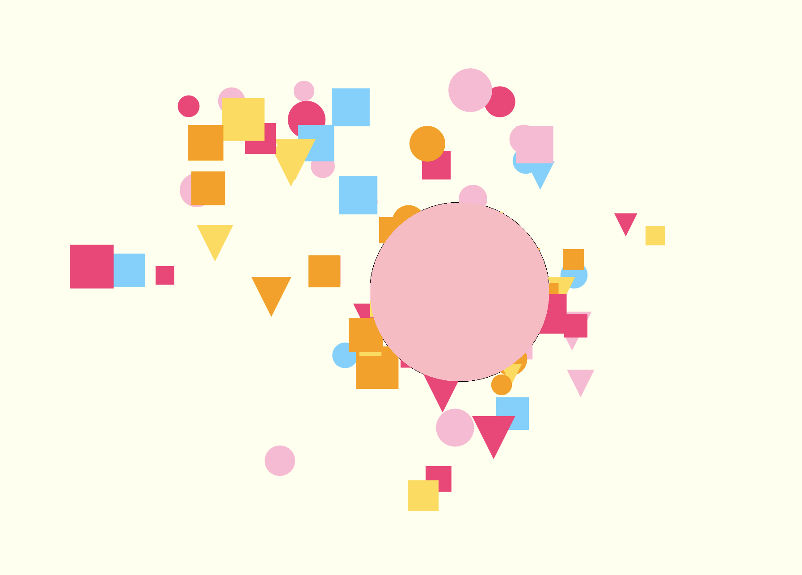
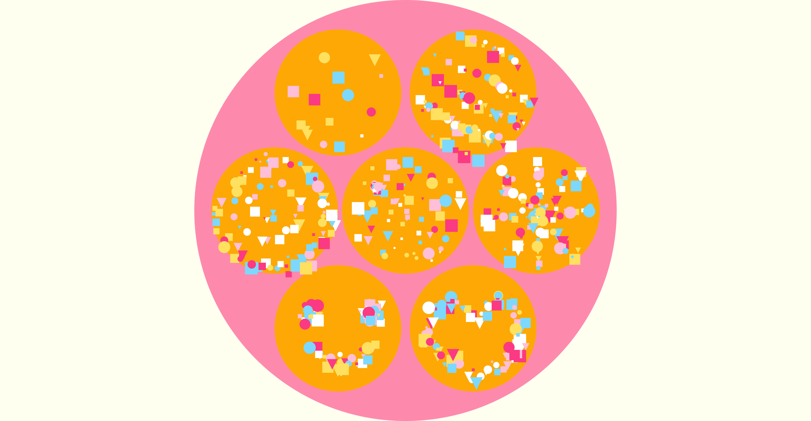
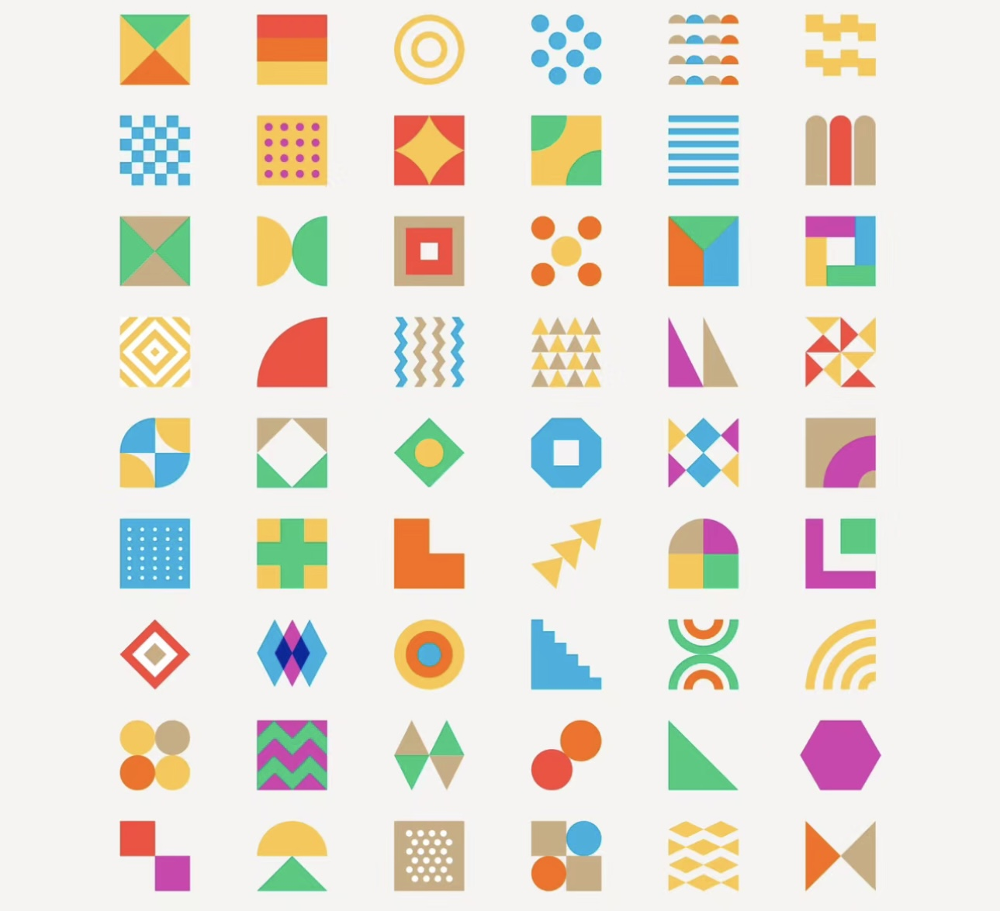
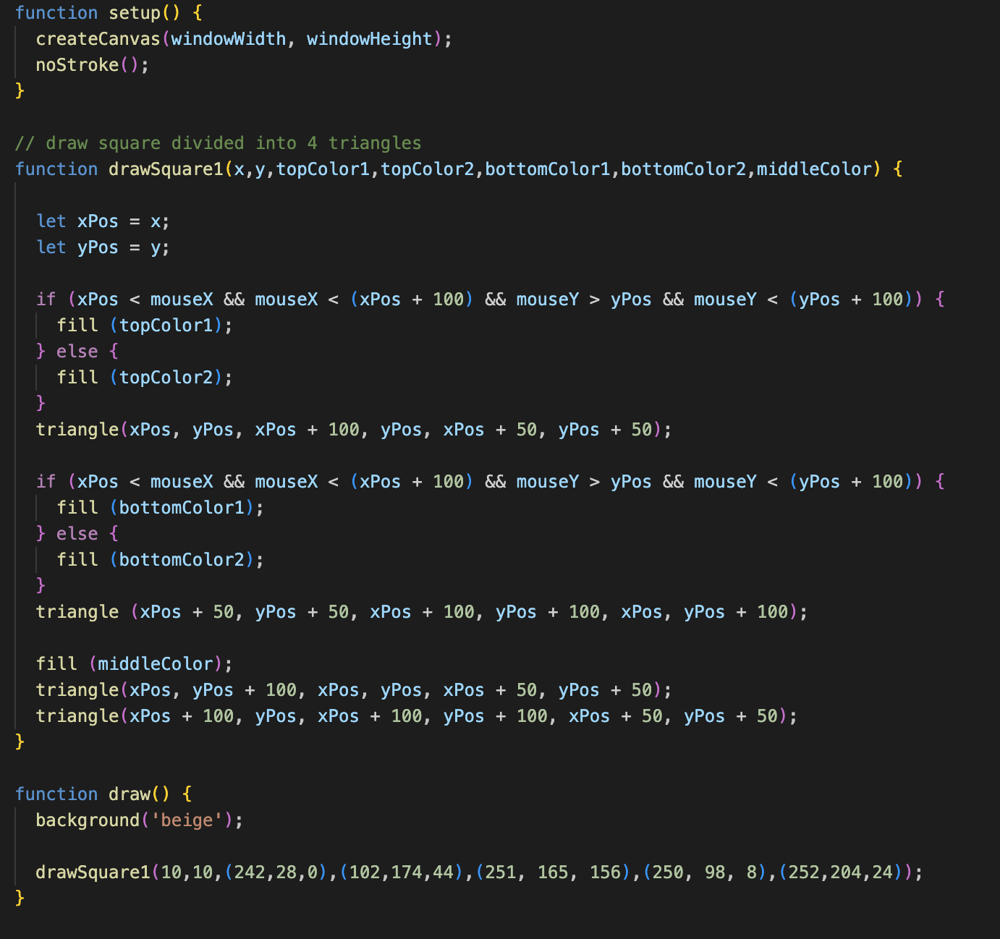
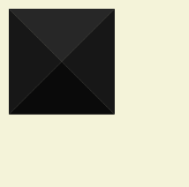

#0 file for HW04B  
Project overview: In this project, I aim to create an engaging and interactive canvas that allows users to easily decorate a virtual sugar cookie with random shapes. Users can click the mouse to add various colorful and fun shapes to their sugar cookie, providing a delightful and creative experience.  

Inspiration:  
 

Key Features:
1. Interactive Canvas: The canvas will provide an interactive environment where users can decorate their sugar cookie.
2. Random Shapes: Users will have random shapes by simply clicking the mouse.
3. Color Palette: Generate random colors from the designed palette.
4. Save Canvas.
5. Clear Canvas.  

Thinking Process:
  

Hard Part:  

1. Generate random colors from the designed palette. I understood the way to generate random colors. In this project, I wanna try to select a random color from the designed palette to fill shapes. However, it's a little challenging to write if() to fill different colors, since there are too many function, including draw 3 different shapes, and mouseClick() function.

2. Make cookie shapes behind the small decorations. First, I used ellipse() in function draw(), but the cookie shape is above the small decorations. Like this:  
  

Later, I figured it out by using drawCircle() in function setup().

Fun Part:
Draw a random shape. It's efficient to create function to draw 3 shapes. And then use if(), where the way used in Random Lottery example, to achieve the feature.  

Final outcome:
  

#1 file for personal practice  
Project overview: In this project, I found an illustration design featuring a blend of geometric shapes. My goal is to recreate these intricate combinations of shapes and implement the mouseMove() function to enable color changes when hovering over each shape.

Reference:

Hard Part:  

I put the wrong code for color setting on the last line of the code. So the shapes all look in black tone, like this:

Haven't finished yet. Still working on this project.

